# CellphoneS RAG Chatbot: End-to-End Crawler, Indexing, and Hybrid Retrieval Pipeline

This repository implements a complete, end-to-end Retrieval-Augmented Generation (RAG) backend pipeline for a chatbot representing **CellphoneS**, a leading tech retail store in Vietnam. The pipeline spans web crawling (scraping store policies, product specifications, and FAQs), advanced text preprocessing (context-rich chunking, metadata creation, and table formatting), local database indexing (ChromaDB & FAISS), and a routing-enabled hybrid retrieval engine with LLM planning and Cross-Encoder reranking.

---

## 🤖 System Architecture & Data Flow

The following diagram illustrates both the offline data ingestion process and the online hybrid retrieval pipeline:

```mermaid
graph TD
    %% Offline Ingestion
    subgraph Offline Ingestion Pipeline
        A[CellphoneS Website] -->|Playwright Scrapers| B[(Raw Data: JSON)]
        B -->|prepare_products_chunks.py| C[Product Chunks + Context Injection]
        B -->|prepare_policy.py| D[Policy Chunks + MD Table Parse + Context Injection]
        C --> E[SentenceTransformer: vietnamese-sbert]
        D --> E
        E -->|Generate Vector Embeddings| F[(ChromaDB Collections)]
        E -->|Generate Vector Embeddings| G[(FAISS Index)]
    end

    %% Retrieval Pipeline
    subgraph Online Retrieval Engine
        H[User Query] --> Decomp{Need Decomposition?}
        Decomp -->|Yes| Groq[Groq Llama-3.3-70b]
        Groq -->|Sub-queries| Router[Query Classifier & Product ID Filter]
        Decomp -->|No| Router
        Router -->|Hybrid Search| Hybrid[Vector Search + Lexical BM25]
        Hybrid -->|Candidates| Rerank[PhoRanker Cross-Encoder Reranker]
        Rerank --> N[Top-K Ranked Context Chunks]
    end
```



---

## 📁 Directory Structure

```text
├── crawl-data/                    # Python crawler scripts powered by Playwright
│   ├── crawl_url_and_name.py      # Crawls listing pages to gather product URLs, IDs, and names
│   ├── crawl_spec_and_variant.py  # Crawls product pages to extract specs & variants (price, stock)
│   ├── crawl_description.py       # Extracts detailed promotional descriptions and key features
│   ├── crawl_policy.py            # Crawls store policies & warranty rules from cellphones.com.vn/tos
│   ├── crawl_faq.py               # Crawls accordion Frequently Asked Questions (FAQs)
│   └── list_iphone_links.txt      # Helper text file containing target product URLs
├── data/                          # Crawled datasets and pre-processed chunks
│   ├── list_product_details.json  # Raw crawled details of all products
│   ├── test_product_details.json  # Subset of product data used for testing
│   ├── policy.json                # Raw store policies crawled from TOS
│   ├── faq.json                   # Product-specific Frequently Asked Questions
│   ├── prepared_products_chunks.json # Context-injected, ready-to-embed product chunks
│   └── prepared_policy_chunks.json   # Markdown table parsed, clause-splitted policy chunks
├── embeddings/                    # FAISS binary search index files
│   ├── faiss_index.bin            # Binary index storing float32 embeddings
│   └── metadata.pkl               # Serialized metadata map corresponding to FAISS indices
├── utils/                         # Processing & Database construction scripts
│   ├── prepare_products_chunks.py # Converts structured product specs/variants into natural sentences
│   ├── prepare_policy.py          # Formats policy tables to MD and splits them into logical clauses
│   ├── build_chroma.py            # Populates two local collections in ChromaDB using local embeddings
│   └── build_faiss.py             # Computes embeddings and writes the FAISS vector index database
├── chroma_db/                     # Local ChromaDB persistent database storage (ignored by git)
├── test_search.py                 # CLI query testing script (Hybrid, Lexical, Semantic comparison)
├── .env                           # Local environment configuration (ignored by git)
├── .gitignore                     # Git ignore rules
└── README.md                      # Project documentation
```

---

## 🛠️ Prerequisites & Setup

Ensure you have Python 3.8+ installed.

### 1. Create and Activate a Virtual Environment
```bash
python -m venv .venv

# On Windows (PowerShell):
.venv\Scripts\Activate.ps1

# On macOS/Linux:
source .venv/bin/activate
```

### 2. Install Project Dependencies
```bash
pip install playwright chromadb faiss-cpu sentence-transformers rank_bm25 underthesea numpy requests python-dotenv
```

### 3. Install Playwright Web Browsers
```bash
playwright install chromium
```

---

## 🚀 How to Run the End-to-End Pipeline

### Step 1: Gather & Crawl Raw Data
The scraping scripts in `crawl-data/` should be run in sequence:
1. **Gather Product URLs**: Scrapes all target product names and URLs into a base template.
   ```bash
   python crawl-data/crawl_url_and_name.py
   ```
2. **Scrape Specifications & Variants**: Opens each product page to extract technical specifications and variant options (color, price, stock status).
   ```bash
   python crawl-data/crawl_spec_and_variant.py
   ```
3. **Scrape Features & Descriptions**: Fetches key highlights and textual descriptions.
   ```bash
   python crawl-data/crawl_description.py
   ```
4. **Scrape Store Policies**: Crawls the official Terms of Service page to extract policies.
   ```bash
   python crawl-data/crawl_policy.py
   ```
5. **Scrape FAQs**: Iterates over products to extract accordion Q&As.
   ```bash
   python crawl-data/crawl_faq.py
   ```

### Step 2: Data Preprocessing & Chunking
Transform the raw, unstructured JSON datasets into structured, context-rich chunks:
1. **Prepare Products**:
   ```bash
   python utils/prepare_products_chunks.py
   ```
2. **Prepare Policies**:
   ```bash
   python utils/prepare_policy.py
   ```
*Outputs: Generates `data/prepared_products_chunks.json` and `data/prepared_policy_chunks.json`.*

### Step 3: Build Vector Indices
Populate the vector databases using the local embedding model `keepitreal/vietnamese-sbert` (approx. 540MB, automatically downloaded on first run):
1. **Build ChromaDB**: Populates local Chroma database collections `product_collection` and `policy_collection`.
   ```bash
   python utils/build_chroma.py
   ```
2. **Build FAISS Index**: Builds a flat L2 index for quick offline lookup.
   ```bash
   python utils/build_faiss.py
   ```

### Step 4: Run Retrieval Tests
Configure your `GROQ_API_KEY` in the `.env` file first:
```env
GROQ_API_KEY=your_groq_api_key_here
```

Then run the CLI utility to perform test queries and view the beautifully colored search results:
```bash
python test_search.py
```

---

## 🧠 Core RAG Design & Implementation Details

To achieve high retrieval precision and overcome the typical challenges of Vietnamese e-commerce RAG, the project employs several custom techniques:

### 1. Context Injection
Naive chunking of tabular specs or lists leads to loss of context (e.g., a chunk containing `"RAM: 8GB"` but missing the product name). 
- **Product Chunks**: Converts product attributes into natural language sentences:
  > *Sản phẩm iPhone 16 Pro có thông số Bộ nhớ trong (rom) là 256 GB.*
  > *Sản phẩm iPhone 16 Pro phiên bản màu Titan Sa Mạc có giá bán là 28.990.000₫ và tình trạng kho hàng là Còn hàng.*
- **Policy Chunks**: Appends root hierarchy details to each policy chunk:
  > *[Chính sách CellphoneS] - Chính sách đổi trả*
  > *Chủ đề: Điều 2. Thời gian đổi trả hàng*
  > *Nội dung: ...*

### 2. Query Decomposition & LLM Planning (Groq Llama-3.3)
For complex queries (e.g., comparing products or asking multi-aspect questions), a single semantic search query is insufficient.
- **Decomposition**: The system checks if the query contains comparative terms or references multiple products. If so, it uses the **Groq API** (`llama-3.3-70b-versatile`) to decompose the query into standalone sub-queries.
  - *Example:* *"So sánh iPhone 13 Pro và 14 Pro về giá và pin"* is split into:
    1. `"iPhone 13 Pro giá bao nhiêu"`
    2. `"iPhone 13 Pro dung lượng pin thế nào"`
    3. `"iPhone 14 Pro giá bao nhiêu"`
    4. `"iPhone 14 Pro dung lượng pin thế nào"`

### 3. Hard Product ID Filtering
To prevent confusion between similar models (e.g., "Pro" vs "Pro Max"), the system maps base names in the query to specific `product_ids` and applies metadata filters to the search collections:
- For each sub-query, the system extracts the target product (e.g. `"iPhone 13 Pro"` matches product IDs `iphone-13-pro` and `iphone-13-pro-1tb`).
- A hard metadata filter `{"product_id": {"$in": product_ids}}` is sent to ChromaDB. This forces the search engine to only retrieve candidate chunks belonging to the exact models requested, completely eliminating cross-model noise.

### 4. Hybrid Search & Reciprocal Rank Fusion (RRF)
To ensure high recall (retrieving relevant results even if terms or semantics mismatch):
1. **Vector Branch**: Queries ChromaDB with `vietnamese-sbert` local embeddings.
2. **Lexical Branch**: Performs tokenized keyword matching using a Vietnamese BM25 engine (`underthesea` word tokenizer + `rank_bm25`).
3. **Fusion**: Re-ranks the top results from both branches using:
   $$\text{RRF Score}(d) = \sum_{m \in \text{systems}} \frac{1}{k + r_m(d)}$$
   *(where $k = 60$, and $r_m(d)$ is the rank of document $d$ in retrieval system $m$).*

### 5. Cross-Encoder Reranking (PhoRanker)
After merging candidate chunks from the sub-queries, the system applies deep semantic re-ranking using **PhoRanker** (`itdainb/PhoRanker`), a Cross-Encoder fine-tuned for Vietnamese text similarity:
- The system feeds `[Sub-query, Chunk Text]` pairs into the Cross-Encoder.
- Chunks are sorted in descending order of their semantic similarity scores, prioritizing chunks that directly answer the query aspects.

### 6. Markdown Table Preservation
Store policies contain detailed rules arranged in tables. If parsed as raw text, structured columns become unreadable. `utils/prepare_policy.py` detects tab-separated text and converts it into formatted Markdown tables (e.g. `| Column 1 | Column 2 |`) with padding to preserve structure for downstream LLM generation.
