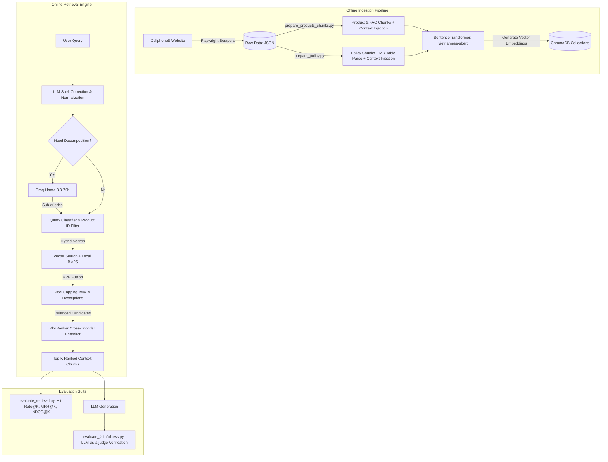

# CellphoneS RAG Chatbot: End-to-End Crawler, Preprocessing, Hybrid Retrieval, & Evaluation Pipeline

This repository implements a complete, end-to-end Retrieval-Augmented Generation (RAG) backend pipeline for a chatbot representing **CellphoneS**, a leading tech retail store in Vietnam. The pipeline spans web crawling (scraping store policies, product specifications, descriptions, and FAQs), advanced text preprocessing (context-rich chunking, metadata creation, and table formatting), local database indexing (ChromaDB), and a routing-enabled hybrid retrieval engine with LLM planning and Cross-Encoder reranking.

Additionally, this project includes a robust evaluation suite assessing both retrieval performance (Hit Rate, MRR, NDCG) and generation trustworthiness (LLM-as-a-judge Faithfulness evaluation).

---

## 🤖 System Architecture & Data Flow

The following diagram illustrates the offline data ingestion process, the online hybrid retrieval pipeline, and the automated evaluation framework:



---

## 📁 Directory Structure

```text
├── crawl-data/                    # Python crawler scripts powered by Playwright
│   ├── crawl_url_and_name.py      # Crawls listing pages to gather product URLs, IDs, and names
│   ├── crawl_spec_and_variant.py  # Crawls product pages to extract specs & variants (price, stock)
│   ├── crawl_description.py       # Extracts detailed promotional descriptions and key features
│   ├── crawl_policy.py            # Crawls store policies & warranty rules from cellphones.com.vn/tos
│   ├── crawl_faq.py               # Crawls accordion Frequently Asked Questions (FAQs)
│   └── list_iphone_links.txt      # Helper text file containing target product URLs
├── data/                          # Crawled datasets and pre-processed chunks
│   ├── list_product_details.json  # Raw crawled details of all products
│   ├── test_product_details.json  # Subset of product data used for testing
│   ├── policy.json                # Raw store policies crawled from TOS
│   ├── faq.json                   # Product-specific Frequently Asked Questions
│   ├── prepared_products_chunks.json # Context-injected, ready-to-embed product chunks
│   └── prepared_policy_chunks.json   # Markdown table parsed, clause-splitted policy chunks
├── utils/                         # Processing & Database construction scripts
│   ├── prepare_products_chunks.py # Converts structured specs, variants, & FAQs into natural sentences
│   ├── prepare_policy.py          # Formats policy tables to MD and splits them into logical clauses
│   └── build_chroma.py            # Populates two local collections in ChromaDB using local embeddings
├── chroma_db/                     # Local ChromaDB persistent database storage (ignored by git)
├── run_pipeline.py                # Pipeline automation script to run all crawlers in sequence
├── test_search.py                 # CLI query testing script with routing, RRF, and reranking
├── evaluate_retrieval.py          # Script to evaluate Hit Rate, MRR, and NDCG on a Golden Dataset
├── evaluate_faithfulness.py       # LLM-as-a-judge script evaluating answer faithfulness
├── .env                           # Local environment configuration (ignored by git)
├── .gitignore                     # Git ignore rules
└── README.md                      # Project documentation
```

---

## 🛠️ Prerequisites & Setup

Ensure you have Python 3.8+ installed.

### 1. Create and Activate a Virtual Environment
```bash
python -m venv .venv

# On Windows (PowerShell):
.venv\Scripts\Activate.ps1

# On macOS/Linux:
source .venv/bin/activate
```

### 2. Install Project Dependencies
```bash
pip install playwright chromadb sentence-transformers rank_bm25 underthesea numpy requests python-dotenv
```

### 3. Install Playwright Web Browsers
```bash
playwright install chromium
```

### 4. Setup Environment Variables
Create a `.env` file in the root directory and configure your Groq API key:
```env
GROQ_API_KEY=your_groq_api_key_here
```

---

## 🚀 How to Run the End-to-End Pipeline

### Step 1: Gather & Crawl Raw Data
You can crawl the data individually or execute the automated pipeline script to run all crawlers in sequence:
```bash
python run_pipeline.py
```
This runs the following scripts in order:
1. **Gather Product URLs**: Scrapes all target product names and URLs.
2. **Scrape Specifications & Variants**: Extracts technical specs and variant options (color, price, stock status).
3. **Scrape Features & Descriptions**: Fetches key highlights and textual descriptions.
4. **Scrape Store Policies**: Scrapes policies and terms of service.
5. **Scrape FAQs**: Iterates over products to extract accordion Q&As.

### Step 2: Data Preprocessing & Chunking
Transform the raw JSON datasets into structured, context-rich chunks:
1. **Prepare Products, Variants & FAQs**:
   ```bash
   python utils/prepare_products_chunks.py
   ```
2. **Prepare Policies**:
   ```bash
   python utils/prepare_policy.py
   ```
*Outputs: Generates `data/prepared_products_chunks.json` and `data/prepared_policy_chunks.json`.*

### Step 3: Build Vector Indices
Populate the vector database using the local embedding model `keepitreal/vietnamese-sbert` (approx. 540MB, automatically downloaded on first run):
```bash
python utils/build_chroma.py
```
This clears and rebuilds two collections in ChromaDB: `product_collection` and `policy_collection`.

### Step 4: Run Retrieval Tests
Run the CLI utility to perform test queries and view the query plan (spell-checking, decomposition, routing, filters) and reranked search results:
```bash
python test_search.py
```

---

## 📊 Evaluation Framework

The project provides dedicated scripts to evaluate retrieval quality and check generated answers for hallucinations.

### 1. Retrieval Performance Evaluation
`evaluate_retrieval.py` benchmarks the retrieval component against a **Golden Dataset** containing test queries mapped to expected products and information types (variants, specs, faq, description).

Metrics computed:
- **Hit Rate @ K**: The percentage of test queries for which the expected product is retrieved in the top K results.
- **MRR @ K (Mean Reciprocal Rank)**: Measures how high up the list the first correct result appears.
- **NDCG @ K (Normalized Discounted Cumulative Gain)**: Evaluates the ranking quality, assigning higher scores for returning the exact information type (e.g. specs vs description) at higher ranks.
- **Average Latency**: Tracks retrieval duration.

To run:
```bash
python evaluate_retrieval.py
```

### 2. Faithfulness Evaluation (LLM-as-a-Judge)
`evaluate_faithfulness.py` assesses whether the chatbot's generated answer contains hallucinations or is strictly backed by the retrieved context. It utilizes a three-step LLM-as-a-judge method powered by `llama-3.3-70b-versatile`:
1. **Statement Extraction**: Tách câu trả lời của chatbot thành các khẳng định (statements) độc lập, ngắn gọn.
2. **Statement Verification**: Đối chiếu từng khẳng định với ngữ cảnh tài liệu để xác định có bằng chứng hỗ trợ hay không (supported: `true` / `false`).
3. **Faithfulness Scoring**: Calculates the final score:
   $$\text{Faithfulness Score} = \frac{\text{Số khẳng định được hỗ trợ}}{\text{Tổng số khẳng định}}$$

To run a test suite showing faithfulness evaluation in action:
```bash
python evaluate_faithfulness.py
```

---

## 🧠 Core RAG Design & Optimization Details

To achieve high retrieval precision and overcome the typical challenges of Vietnamese e-commerce RAG, the project employs several custom techniques:

### 1. Spell Correction & Normalization
Vietnamese queries often contain typos, shorthand (`ip`, `pm`, `dt`, `bh`), or lack accents (e.g., `sac` vs `sắc`). Using Groq Llama-3.3, queries are normalized before search.
- *Example:* `so sanh ip 13 pro vs iphon 14 pro` -> `So sánh iPhone 13 Pro và iPhone 14 Pro`.
- Context-aware normalization distinguishes between `sạc` (sạc pin) and `sắc` (màu sắc) depending on surrounding tokens.

### 2. Query Decomposition
For complex queries (e.g. comparisons or multi-part questions), a single search query is insufficient. The RAG planner decomposes them into standalone, clean sub-queries.
- *Example:* `"ip 16 pr max 128gb gia bao nhieu và co bh ko"` is split into:
  1. `"iPhone 16 Pro Max 128GB giá bao nhiêu"`
  2. `"iPhone 16 Pro Max 128GB chính sách bảo hành"`

### 3. Hard Product ID Filtering
To prevent confusion between similar models (e.g., "Pro" vs "Pro Max"), the system maps base names in the query to specific `product_ids` and applies metadata filters to the search collections:
- A hard metadata filter `{"product_id": {"$in": product_ids}}` is sent to ChromaDB. This forces the search engine to only retrieve candidate chunks belonging to the exact models requested, completely eliminating cross-model noise.

### 4. Hybrid Search & Reciprocal Rank Fusion (RRF)
To ensure high recall, search is conducted on two branches:
1. **Vector Search**: Queries ChromaDB with `vietnamese-sbert` local embeddings.
2. **Lexical Search (Local BM25)**: Performs tokenized keyword matching using a Vietnamese BM25 engine (`underthesea` word tokenizer + `rank_bm25`) on the metadata-filtered subset.
3. **RRF**: Combines ranks from both branches using:
   $$\text{RRF Score}(d) = \sum_{m \in \text{systems}} \frac{1}{k + r_m(d)}$$

### 5. Pool Balancing (Capping Descriptions)
Detailed product descriptions are often very long and can generate numerous chunks that overwhelm specs or pricing variants. The system caps description chunks (`type: description`) to a maximum of 4 in the retrieval pool, keeping the context balanced.

### 6. Cross-Encoder Reranking (PhoRanker)
Top RRF candidates are re-evaluated using **PhoRanker** (`itdainb/PhoRanker`), a Cross-Encoder fine-tuned for Vietnamese text similarity, feeding `[Sub-query, Chunk Text]` pairs to compute deep semantic similarity.

### 7. Markdown Table Preservation & Context Injection
- **Table Preservation**: Store policy rules are often stored in tables. `utils/prepare_policy.py` parses tab-separated structures into formatted Markdown tables with `<br>` spacing to retain columnar layout for the downstream LLM.
- **Context Injection**: Each chunk is prepended with its hierarchical path (e.g., product name or policy section and clause titles) to prevent loss of context when sliced.
